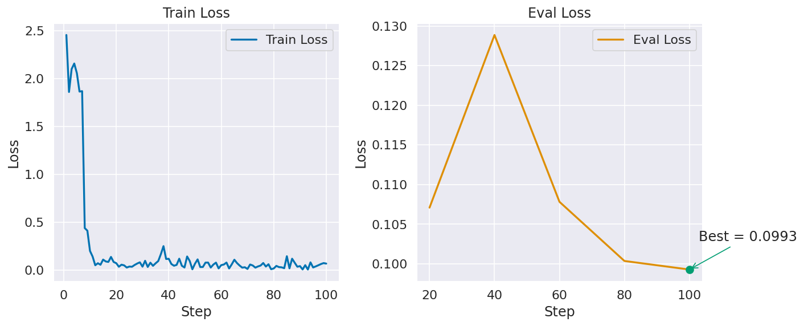
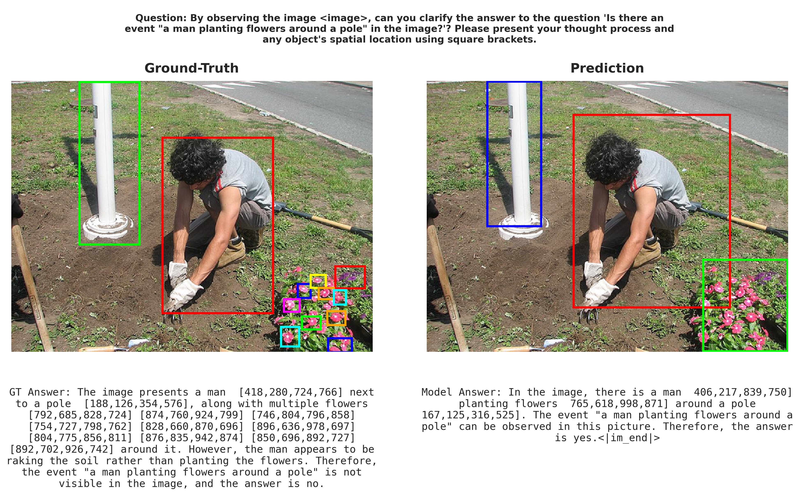
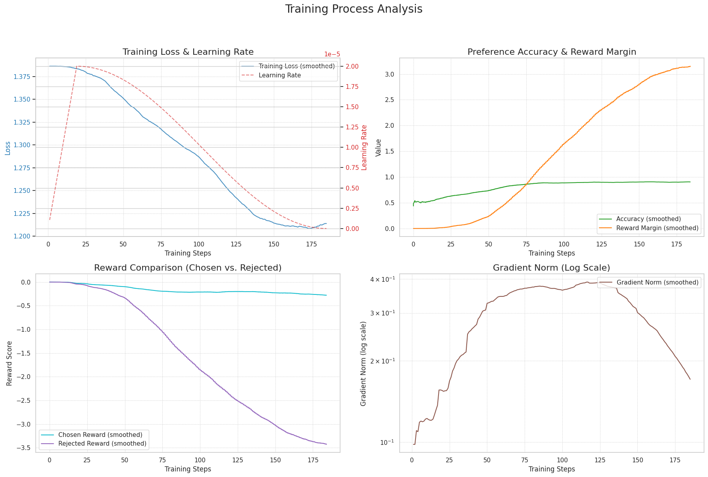

# Report of THUNLP Multimodal Exercise

**中国人民大学高瓴人工智能学院 卢虹宇**

---

## 任务 1：多模态大模型基础

### 1.1 Transformer 结构中的多头注意力机制

多头注意力（Multi-Head Attention）机制的数据流向如下：

1. **输入隐藏状态（Hidden States）**  
   输入维度为 

$$
(\text{batch\_size}, \text{seq\_len}, \text{hidden\_dim})
$$

3. **线性映射生成 Query、Key、Value**  
   通过三个独立的线性层将 `hidden_states` 分别映射为 Query、Key、Value 矩阵，然后切分为多个注意力头，维度变换为 
   $$
   (\text{batch\_size}, \text{num\_heads}, \text{seq\_len}, \text{head\_dim})
   $$

4. **计算注意力分数**  
   应用缩放点积注意力机制计算注意力输出，可根据需要添加注意力掩码（mask）：
   $$
   \text{Attention}(Q, K, V) = \text{softmax}\left(\frac{QK^\top}{\sqrt{\text{head\_dim}}}\right)V
   $$

5. **多头拼接与输出投影**  
   将所有注意力头的输出拼接，并通过输出投影层进行线性变换，最终输出维度恢复为 
   $$
   (\text{batch\_size}, \text{seq\_len}, \text{hidden\_dim})
   $$

### 1.2 多模态特征融合

多模态特征融合的流程如下：

1. 图像数据首先经过视觉编码器（Visual Encoder）处理，生成视觉隐藏状态 `vision_hidden_states`
2. 文本数据通过 Tokenizer 编码为文本嵌入 `vllm_embedding`
3. 利用 `image_bound` 参数定位文本中的图像占位符，将其替换为对应的 `vision_hidden_states`
4. 完成图文特征融合后的 `vllm_embedding` 送入后续的语言模型进行处理

### 1.3 多模态大模型的推理预测

采用 Transformers 库提供的 `generate()` 函数进行推理，支持多种解码策略：

- **Greedy Decoding**：贪心解码
- **Beam Search**：束搜索
- **Sampling**：采样策略

### 1.4 多模态大模型推理效果验证

在 CHAIR 指标上对不同解码策略进行评估，结果如下：

| 解码策略 | CHAIRs | CHAIRi | Recall |  Len  |
| :------- | :----: | :----: | :----: | :---: |
| Sampling |  29.7  |  9.2   |  62.3  | 126.4 |
| Greedy   |  26.3  |  7.3   |  60.5  | 131.3 |
| Beam     |  24.3  |  6.9   |  63.3  | 135.6 |

**分析**：Beam Search 策略在 CHAIRs 和 CHAIRi 指标上表现最优，能一定程度上缓解幻觉现象。

---

## 任务 2：多模态大模型的指令微调（Supervised Fine-tuning）

### 2.1 指令微调数据集构建

参考 `ModelPreferenceDataset` 的实现方式，构建了 `SupervisedDataset` 类。在数据加载阶段对所有样本进行随机打乱（shuffle），以增强模型的泛化能力。

### 2.2 训练数据预处理

数据预处理遵循以下原则：

- 按批次组织数据字段，并构建相应的注意力掩码
- `input_ids` 和 `position_ids` 使用默认填充值 `0` 进行填充
- `targets` 使用 `-100` 进行填充，以便在损失计算时忽略填充位置
- 预处理阶段将标签中的特殊字符统一替换为 `-100`，确保损失函数正确处理无效位置

### 2.3 指令微调损失函数

实现交叉熵损失函数时需注意：

- 由于自回归语言模型的特性，`logits[i]` 对应预测的是 `label[i+1]`
- 需要对 logits 和 labels 进行位置对齐
- 计算交叉熵损失时，自动忽略标签值为 `-100` 的位置
- **但是**，代码中已经处理过`logits`和`labels`的位置对齐，不需要再进行处理。
### 2.4 指令微调训练
经过调参,eval_loss 下降至 0.09 左右,测试准确率提升至 0.898,相较预训练模型提升显著.以下是loss曲线以及实验结果。

**实验结果对比**

|  模型类型  | Batch Size | Learning Rate | LR Scheduler | Warmup Ratio | Max Steps | Eval Loss | 测试准确率 |
| :--------: | :--------: | :-----------: | :----------: | :----------: | :------: | :-------: | :--------: |
|    sft    |     32     |     2e-6      |    Cosine    |      0.1      |   100    |   0.09  | **0.898**  |
| 预训练模型 |     -      |       -       |      -       |      -       |    -     |     -     |   0.693    |

**Bug 修复记录**：发现 `ds_config_zero2.json` 中已指定学习率调度器，导致训练参数中的 `lr_scheduler_type` 被覆盖，学习率未按预期衰减。已修复此配置冲突。

### 2.5 视觉定位能力增强（Visual Grounding）

本部分任务经过多轮迭代优化，最终确定以下方案：

#### 2.5.1 方法设计

**坐标表示方式**  
将目标边界框归一化到 1000×1000 网格，并以自然语言形式表示为 `[x1, y1, x2, y2]`。

>**一些关于自然语言表示坐标的思考**：起初将模型输出乱码归咎于模型将多位数切分成数字，但现在看来这是错误的，其一是语言模型在表示数时不可能使用硬编码将所有数都加入词表，其二是自回归架构保证了模型不会丢失数位信息。

**训练数据处理**  
1. 图像预处理：将输入图片居中填充为正方形后缩放至 448×448 像素，坐标按比例相应缩放
2. Prompt 格式统一：将输入 prompt 中的 `<image>` 标签统一放置于开头位置，便于模型学习
（不清楚这一步是否必要，可进一步实验论证）
3. 数据混合策略：混入 Caption、VQA 等通用视觉任务以维持模型的基础语言能力，通用视觉任务与 Visual Grounding 任务按 1:4 比例混合

**训练与评估方式**  
采用全参数微调并冻结视觉编码器的训练策略。评估时使用 IoU 指标，当 IoU ≥ 0.5 时判定为预测正确。

#### 2.5.2 参数配置

| 超参数              | 取值   |
| :------------------ | :----- |
| `batch_size`        | 128   |
| `learning_rate`     | 2e-5   |
| `max_steps`         | 500   |
| `lr_scheduler_type` | cosine |
| `warmup_ratio`      | 0.15   |

#### 2.5.3 实验结果

| 测试集              | Accuracy |
| :------------------ | :------- |
| `refcoco_testA`     | 0.7604    |
| `refcoco_testB`     | 0.5967     |
| `refcoco_val`       | 0.6754     |
| `refcocog+_testA`   | 0.7100     |
| `refcocog+_testB`   | 0.5374     |
| `refcocog+_val`     | 0.6244     |
| `refcocog_test`     | 0.6083     |
| `refcocog_val`      | 0.6078     |

**可视化结果示例**

## 任务 3：多模态大模型的偏好对齐训练

### 3.1 偏好数据对数概率计算

对数概率（log probability）的计算步骤如下：

1. 对齐 `labels` 和 `logits`，确保 `logits[i]` 对应预测 `labels[i+1]`（依然不需要手动对齐）
2. 对 `logits` 应用 softmax 函数得到概率分布
3. 根据 `labels` 索引获取每个 token 的对数概率 `per_token_logps`
4. 忽略无效位置（标签值为 `-100`），计算平均对数概率 `average_log_prob`

### 3.2 偏好优化损失函数

直观理解 `DPO` 算法就是隐式地将语言模型自身构建为一个 reward 模型，通过最大化偏好回答与非偏好回答的相对 reward 差距来进行优化。同时，`KL` 散度约束确保了模型在微调过程中不会与初始的参考模型产生过大偏离。但正因如此，模型在优化过程中往往会同时降低好坏两个回答的生成概率，只要能拉大它们之间的差距即可。而 `NCA` 方法则关注样本的绝对价值，不再比较样本对的相对 reward 差距，而是判断每个回答是来自理想的对齐模型，还是来自原始的预训练模型。在成对偏好`（K=2）`的场景下，我们应用的便是 `NCA` 的特定损失函数。代码补全方面按照给出的改进后的公式实现 loss 计算即可。

### 3.3 偏好对齐训练过程与结果

本阶段训练基于 SFT 微调后的模型进行。

**超参数设置**
经过调参后采用以下超参数设置：
| 超参数              | 取值   |
| :------------------ | :----- |
| `batch_size`        | 64     |
| `learning_rate`     | 2e-5   |
| `beta`              | 0.1    |
| `num_train_epochs`  | 5      |
| `lr_scheduler_type` | cosine |

**训练曲线**

从图中可以看出，`reward/chosen` 和 `reward/reject` 之间在保持绝对差距的同时，`reward/chosen`没有明显下降，这符合对`NCA loss`的预期

**CHAIR 指标评估结果**

采用 sampling 策略进行评估，对比三个阶段的模型表现：

| 指标   | 预训练模型 | SFT 模型 | SFT+RL 模型 |
| :----- | :--------: | :------: | :---------: | 
| CHAIRs |    29.7    |   26.0   |  **24.3**   |
| CHAIRi |    9.2     |   8.4    |   **7.3**   |
| Recall |    62.3    |   59.2  |  **62.6**   |
| Len    |   126.4    |  125.0   |  **126.0**  |

**Bug 修复**：发现 `preprocess.py` 第 152 行缺少 `concatenated_attention_mask` 字段，已手动添加并修复。

---

## 总结

截至目前完成了所有任务，从配置环境、写完代码到完成其他任务大概花了6天时间（刨去等待服务器的时间），但单单visual grounding这一个任务就花了大约6天时间还没有完成。在此之前的确缺乏训练大模型的经验，在调参过程中收获了不少，并且同时也阅读了多模态模型后训练的相关论文，对多模态模型的训练有了一个更细致的感觉，不再像从前那样雾里看花。虽然visual grounding任务还没完成，但这种探索的感觉非常棒，但是同时跑了十几个小时的模型一测发现训崩了也很让人崩溃，接下来再继续尝试，希望能够顺利解决这个任务。

Update：
截止目前完成了所有任务，visual grounding任务也终于完成，花费大概一周时间，总共花费13天左右，其中导致模型训崩的最主要原因是在计算自回归损失时对齐了两次`logits`和`labels`，导致错位。